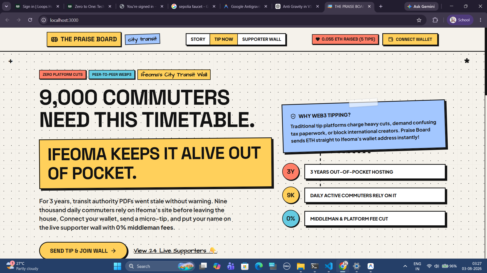
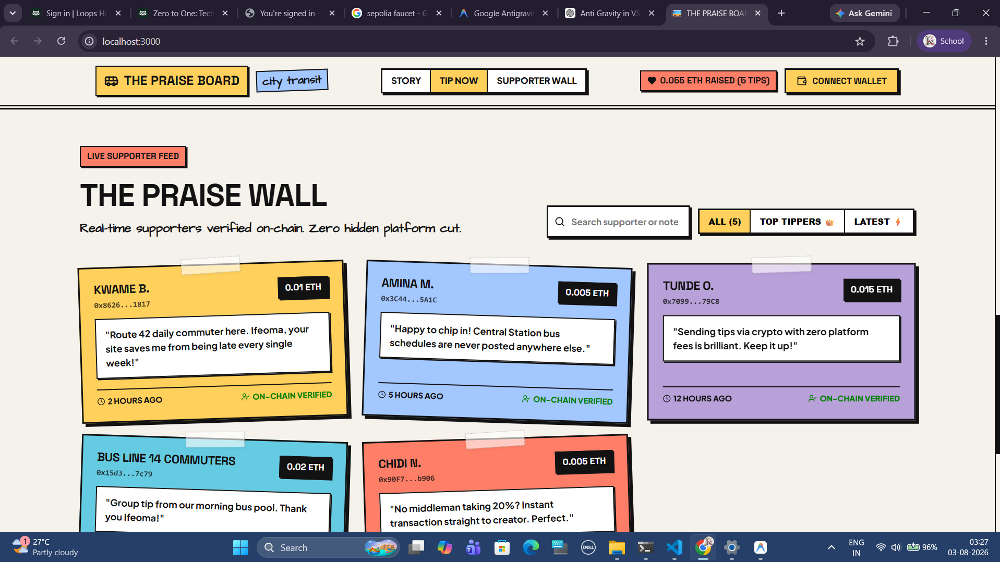
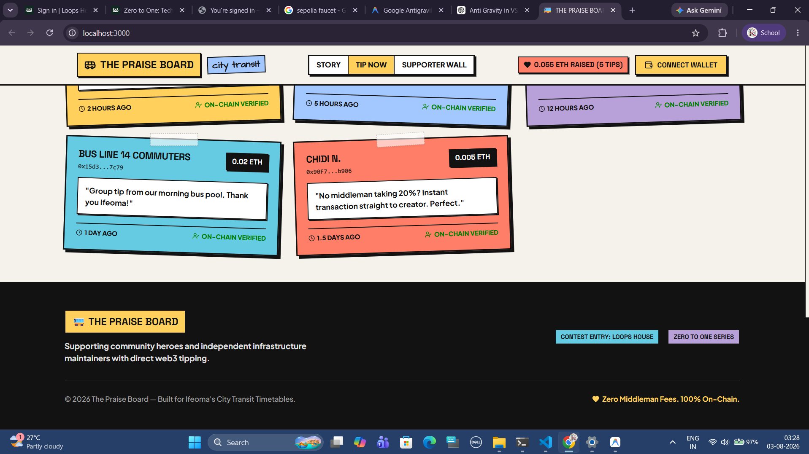

# 🌟 The Praise Board — Decentralized Tipping & Supporter Wall

> **Direct, zero-middleman Web3 micro-tipping for public utility creators.**  
> Built for *Ifeoma's City Transit Timetables* as part of the **Zero to One: Tech Builder Series**.

---

## 📖 Overview

For over three years, Ifeoma has maintained her city's bus timetables online out of her own pocket, helping thousands of commuters get to work on time. Traditional tipping platforms take heavy cuts, require complex tax paperwork, or restrict accounts based on geographic location.

**The Praise Board** solves this by providing a simple, permissionless Web3 micro-tipping platform:
- Commuters connect their Web3 wallet (MetaMask / EVM).
- Send ETH micro-tips directly with an optional display name and heartfelt message.
- 100% of the funds are forwarded **instantly** to Ifeoma's wallet on-chain without any platform taking a cut.
- Every tip is recorded on an interactive, live **Supporter Wall**.

---

## ✨ Features

- **⚡ Direct On-Chain Transfers**: 100% of tipped funds transfer directly to the target wallet via smart contract — zero platform fees.
- **📜 Live Supporter Wall**: Displays real-time tips, donor names, messages, transaction values, and timestamps fetched directly from the blockchain.
- **💬 Custom Notes & Names**: Supporters can leave personalized thank-you notes or tip anonymously.
- **🦊 Seamless MetaMask Integration**: Interactive wallet connection with real-time balance and network indicators.
- **🎨 Glassmorphic Modern UI**: Built with React 18, Vite, Lucide React icons, and custom styling for a sleek user experience.
- **🛡️ Secure & Verified Smart Contract**: Solidity contract featuring custom error handling, event emission, fallback ETH receivers, and unit tests.

---

## 📸 Interface Previews

| Hero Section | Direct Web3 Tipping Widget |
| :---: | :---: |
|  |  |

| Live Supporter Wall | Footer & Project Info |
| :---: | :---: |
|  |  |

---

## 🛠️ Tech Stack

- **Smart Contract**: Solidity (`^0.8.20`), Hardhat
- **Blockchain Client**: Ethers.js (`v6`)
- **Frontend Framework**: React 18, Vite
- **UI & Icons**: Tailwind CSS, Lucide React Icons
- **Testing**: Hardhat Toolbox / Chai & Mocha

---

## 📁 Project Structure

```
blockchain-praise-board/
├── contracts/
│   └── PraiseBoard.sol       # Core Smart Contract
├── scripts/
│   └── deploy.js             # Hardhat deployment script
├── src/
│   ├── components/
│   │   ├── Navbar.jsx        # Web3 Header & Wallet Connect Button
│   │   ├── Hero.jsx          # Impact banner & live stats summary
│   │   ├── TipWidget.jsx     # Interactive Tipping Form
│   │   ├── SupporterWall.jsx # Live feed of on-chain messages
│   │   └── Footer.jsx        # Footer & links
│   ├── contracts/
│   │   └── deployment.json   # Deployed contract address & ABI
│   ├── App.jsx               # Main React Application
│   └── index.css             # Design tokens & styles
├── test/
│   └── PraiseBoard.test.js   # Unit test suite for PraiseBoard
├── hardhat.config.js         # Hardhat configuration
├── package.json              # Dependencies and scripts
└── README.md                 # Project documentation
```

---

## 🚀 Getting Started

### Prerequisites

- [Node.js](https://nodejs.org/) (`v18.x` or higher)
- [Git](https://git-scm.com/)
- [MetaMask Wallet](https://metamask.io/) browser extension

### Installation

1. **Clone the repository:**
   ```bash
   git clone https://github.com/Ketki1312/blockchain-praise-board.git
   cd blockchain-praise-board
   ```

2. **Install dependencies:**
   ```bash
   npm install
   ```

---

## 💻 Local Development Workflow

### 1. Compile Smart Contracts
```bash
npm run compile
```

### 2. Run Unit Tests
```bash
npm run test
```

### 3. Deploy to Local Blockchain Node

Start a local Hardhat node in one terminal window:
```bash
npx hardhat node
```

In a second terminal window, deploy the contract to the local network:
```bash
npm run deploy
```

### 4. Run Frontend App
```bash
npm run dev
```
Open your browser and navigate to `http://localhost:5173`.

---

## 📜 Smart Contract Reference

### `PraiseBoard.sol`

| Function | Type | Description |
| :--- | :--- | :--- |
| `sendTip(string _name, string _message)` | `external payable` | Sends a tip with a supporter name & note. Forwards ETH directly to owner. |
| `getAllTips()` | `external view` | Returns an array of all recorded `Tip` structs. |
| `getTipCount()` | `external view` | Returns total tip count. |
| `receive()` | `external payable` | Fallback receiver for direct ETH transfers. |

### Events
- `event NewTip(address indexed sender, string name, string message, uint256 amount, uint256 timestamp)`
- `event FundsTransferred(address indexed to, uint256 amount)`

---

## 📄 License

This project is licensed under the [MIT License](LICENSE).
